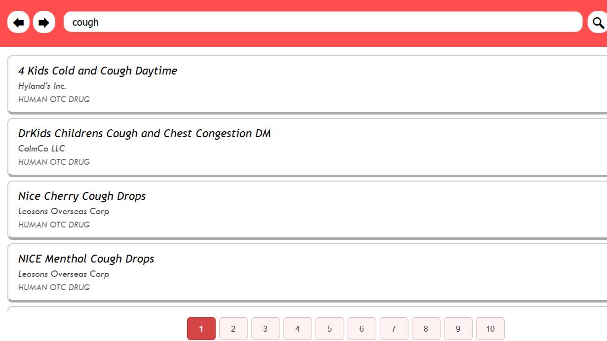

<h1 align="center">
    PharmaSearch
</h1>

<p align="center">
    
<p align="center">

## Description
PharmaSearch is a full-text drug search application written purely in Python! With this app, you can search drugs, filtered search results by drug type (such as OTC drugs and Prescription drugs), and undo/redo operations. The search results are also paginated. Below is a typical example of what the main window looks like!

<p align="center">
    
<p align="center">

## Dataset
The dataset used by this project was downloaded from OpenFDA's '/drug/label' dataset containing over 280,000 drugs represented in JSON format. However, not all drug entries were usable since some of them had missing essential information. We ended up having to write Python scripts to filter out drug entries that were unusable. In the end, the project was left with around 80,800 drug entries.

Here is the link to the drug dataset we used: [OpenFDA's Drug Dataset](https://open.fda.gov/data/downloads/) (the `/drug/label` dataset)

If you wish to use this dataset to display drug data, I would suggest you find a different one as this dataset is not formatted properly (e.g. no line breaks which is bad if the content is supposed to be a list).

## How to install and run on your machine
<b>Note:</b> Sorry, this only works on Windows right now! We used the `pybind11` module to integrate the speed of C++ to speed up some expensive operations. However, using it requires a different setup for different operating systems.

### Make sure you have these installed first!
- Python 3.13.1
- 7-Zip

### Follow these steps:
1. Unzip the `drug_data.7z` file. The outcome here should be a folder `app/drug_data` which contains the following directories directly:
    - otc_drugs
    - prescription_drugs
    - scripts_used
2. Start a terminal session with the `app` folder as the current working directory.
3. Run this command to install the dependencies:
    ```
    pip install -r requirements.txt
    ```
4. Run this command to run the program:`
    ```
    python main.py
    ```